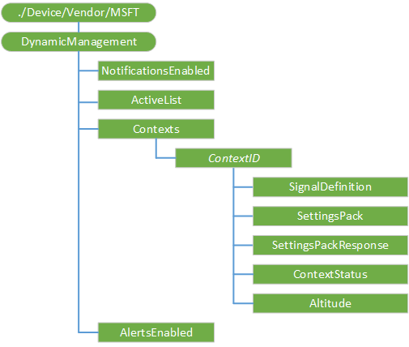

# DynamicManagement CSP

Windows 10 allows you to manage devices differently depending on location, network, or time.  In Windows 10, version 1703 the focus is on the most common areas of concern expressed by organizations. For example, managed devices can have cameras disabled when at a work location, the cellular service can be disabled when outside the country to avoid roaming charges, or the wireless network can be disabled when the device is not within the corporate building or campus. Once configured, these settings will be enforced even if the device can’t reach the management server when the location or network changes. The Dynamic Management CSP enables configuration of policies that change how the device is managed in addition to setting the conditions on which the change occurs.  

This CSP was added in Windows 10, version 1703.

The following diagram shows the DynamicManagement configuration service provider in tree format.



<a href="" id="dynamicmanagement"></a>**DynamicManagement**  
<p style="margin-left: 20px">The root node for the DynamicManagement configuration service provider.</p>

<a href="" id="notificationsenabled"></a>**NotificationsEnabled**  
<p style="margin-left: 20px">Boolean value for sending notification to the user of a context change.</p>
<p style="margin-left: 20px">Default value is False. Supported operations are Get and Replace.</p>
<p style="margin-left: 20px">Example to turn on NotificationsEnabled:</p>

``` syntax
<Replace>
      <CmdID>100</CmdID>
      <Item>
        <Target>
          <LocURI>./Vendor/MSFT/DynamicManagement/NotificationsEnabled</LocURI>
        </Target>
        <Meta>
          <Type xmlns="syncml:metinf">text/plain</Type>
          <Format xmlns="syncml:metinf">bool</Format>
        </Meta>
          <Data>true</Data>        
      </Item>
</Replace>
```
<a href="" id="activelist"></a>**ActiveList**  
<p style="margin-left: 20px">A string containing the list of all active ContextIDs on the device.  Delimeter is unicode character 0xF000..</p>
<p style="margin-left: 20px">Supported operation is Get.</p>  

<a href="" id="contexts"></a>**Contexts**  
<p style="margin-left: 20px">Node for context information.</p>
<p style="margin-left: 20px">Supported operation is Get.</p>

<a href="" id="contextid"></a>***ContextID***  
<p style="margin-left: 20px">Node created by the server to define a context.  Maximum amount of characters allowed is 38.</p>
<p style="margin-left: 20px">Supported operations are Add, Get, and Delete.</p>

<a href="" id="signaldefinition"></a>**SignalDefinition**  
<p style="margin-left: 20px">Signal Definition XML.</p>
<p style="margin-left: 20px">Value type is string. Supported operations are Add, Get, Delete, and Replace.</p>

<a href="" id="settingspack"></a>**SettingsPack**  
<p style="margin-left: 20px">Settings that get applied when the Context is active.</p>
<p style="margin-left: 20px">Value type is string. Supported operations are Add, Get, Delete, and Replace.</p>

<a href="" id="settingspackresponse"></a>**SettingsPackResponse**  
<p style="margin-left: 20px">Response from applying a Settings Pack that contains information on each individual action..</p>
<p style="margin-left: 20px">Value type is string. Supported operation is Get.</p>

<a href="" id="contextstatus"></a>**ContextStatus**  
<p style="margin-left: 20px">Reports status of the context.  If there was a failure, SettingsPackResponse should be checked for what exactly failed..</p>
<p style="margin-left: 20px">Value type is integer. Supported operation is Get.</p>

<a href="" id="altitude"></a>**Altitude**  
<p style="margin-left: 20px">A value that determines how to handle conflict resolution of applying multiple contexts on the device. This is required and must be distinct of other priorities..</p>
<p style="margin-left: 20px">Value type is integer. Supported operations are Add, Get, Delete, and Replace.</p>

<a href="" id="alertsenabled"></a>**AlertsEnabled**  
<p style="margin-left: 20px">A Boolean value for sending an alert to the server when a context fails.</p>
<p style="margin-left: 20px">Supported operations are Get and Replace.</p>

## Examples

Disable Cortana based on Geo location and time, From 9am-5pm, when in the 100 meters radius of the specified latitude/longitude

``` syntax
    <Replace>
      <CmdID>200</CmdID>
      <Item>
        <Target>
          <LocURI>./Vendor/MSFT/DynamicManagement/Contexts/Bldg109/SettingsPack</LocURI>
        </Target>
        <Meta>
          <Type xmlns="syncml:metinf">text/plain</Type>
          <Format xmlns="syncml:metinf">chr</Format>
        </Meta>
        <Data>&lt;SyncML&gt;
  &lt;SyncBody&gt;&lt;Replace&gt;&lt;CmdID&gt;1001&lt;/CmdID&gt;&lt;Item&gt;&lt;Target&gt;&lt;LocURI&gt;./Vendor/MSFT/Policy/Config/Experience/AllowCortana&lt;/LocURI&gt;&lt;/Target&gt;&lt;Meta&gt;&lt;Format xmlns=&quot;syncml:metinf&quot;&gt;int&lt;/Format&gt;&lt;/Meta&gt;&lt;Data&gt;0&lt;/Data&gt;&lt;/Item&gt;&lt;/Replace&gt;&lt;Final/&gt;&lt;/SyncBody&gt;&lt;/SyncML&gt;</Data>
      </Item>
    </Replace>
    <Replace>
      <CmdID>201</CmdID>
      <Item>
        <Target>
          <LocURI>./Vendor/MSFT/DynamicManagement/Contexts/Bldg109/SignalDefinition</LocURI>
        </Target>
        <Meta>
          <Type xmlns="syncml:metinf">text/plain</Type>
          <Format xmlns="syncml:metinf">chr</Format>
        </Meta>
        <Data>
          &lt;rule schemaVersion=&quot;1.0&quot;&gt;
          
           &lt;and&gt;
                    &lt;signal type="geoloc" latitude="47.6375" longitude="-122.1402" radiusInMeters="100"/&gt;        
                    &lt;signal type=&quot;time&quot;&gt;
                              &lt;daily startTime=&quot;09:00:00&quot; endTime=&quot;17:00:00&quot;/&gt;
                    &lt;/signal&gt;           
           &lt;/and&gt;
          &lt;/rule&gt;
        </Data>
      </Item>
    </Replace>
    <Replace>
      <CmdID>202</CmdID>
      <Item>
        <Target>
          <LocURI>./Vendor/MSFT/DynamicManagement/Contexts/Bldg109/Altitude</LocURI>
        </Target>
        <Meta>
          <Format xmlns="syncml:metinf">int</Format>
        </Meta>
        <Data>3</Data>
      </Item>
    </Replace>
```

Disable camera using network trigger with time trigger, from 9-5, when ip4 gateway is 192.168.0.1

``` syntax
<Replace>
      <CmdID>300</CmdID>
      <Item>
        <Target>
          <LocURI>./Vendor/MSFT/DynamicManagement/Contexts/NetworkWithTime/SettingsPack</LocURI>
        </Target>
        <Meta>
          <Type xmlns="syncml:metinf">text/plain</Type>
          <Format xmlns="syncml:metinf">chr</Format>
        </Meta>
        <Data>&lt;SyncML&gt;
  &lt;SyncBody&gt;&lt;Replace&gt;&lt;CmdID&gt;1002&lt;/CmdID&gt;&lt;Item&gt;&lt;Target&gt;&lt;LocURI&gt;./Vendor/MSFT/Policy/Config/Camera/AllowCamera&lt;/LocURI&gt;&lt;/Target&gt;&lt;Meta&gt;&lt;Format xmlns=&quot;syncml:metinf&quot;&gt;int&lt;/Format&gt;&lt;/Meta&gt;&lt;Data&gt;0&lt;/Data&gt;&lt;/Item&gt;&lt;/Replace&gt; &lt;Final/&gt;&lt;/SyncBody&gt;&lt;/SyncML&gt;</Data>
      </Item>
    </Replace>
    <Replace>
      <CmdID>301</CmdID>
      <Item>
        <Target>
          <LocURI>./Vendor/MSFT/DynamicManagement/Contexts/ NetworkWithTime /SignalDefinition</LocURI>
        </Target>
        <Meta>
          <Type xmlns="syncml:metinf">text/plain</Type>
          <Format xmlns="syncml:metinf">chr</Format>
        </Meta>
        <Data>
          &lt;rule schemaVersion=&quot;1.0&quot;&gt;          
           &lt;and&gt;
             &lt;signal type="ipConfig"&gt; 
                   &lt;ipv4Gateway&gt;192.168.0.1&lt;/ipv4Gateway&gt; 
             &lt;/signal&gt; 
                    &lt;signal type=&quot;time&quot;&gt;
                              &lt;daily startTime=&quot;09:00:00&quot; endTime=&quot;17:00:00&quot;/&gt;
                    &lt;/signal&gt;  
           &lt;/and&gt;
          &lt;/rule&gt;
        </Data>
      </Item>
    </Replace>
    <Replace>
      <CmdID>302</CmdID>
      <Item>
        <Target>
          <LocURI>./Vendor/MSFT/DynamicManagement/Contexts/ NetworkWithTime /Altitude</LocURI>
        </Target>
        <Meta>
          <Format xmlns="syncml:metinf">int</Format>
        </Meta>
        <Data>10</Data>
      </Item>
    </Replace>
```

Delete a context

``` syntax
<Delete>
      <CmdID>400</CmdID>
      <Item>
        <Target>
          <LocURI>./Vendor/MSFT/DynamicManagement/Contexts/NetworkWithTime</LocURI>
        </Target>
      </Item>
</Delete>
```

Get ContextStatus and SignalDefinition from a specific context

``` syntax
<Get>
      <CmdID>400</CmdID>
      <Item>
        <Target>
          <LocURI>./Vendor/MSFT/DynamicManagement/Contexts/NetworkWithTime/ContextStatus</LocURI>
        </Target>
      </Item>
</Get>
<Get>
      <CmdID>401</CmdID>
      <Item>
        <Target>
          <LocURI>./Vendor/MSFT/DynamicManagement/Contexts/NetworkWithTime/SignalDefinition </LocURI>
        </Target>
      </Item>
</Get>
```