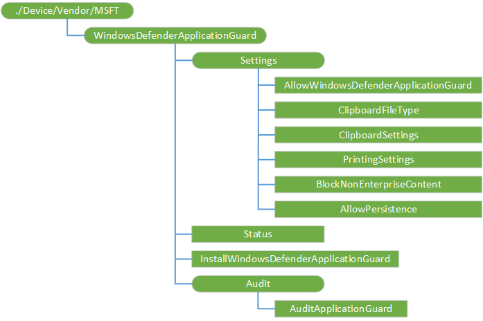

# WindowsDefenderApplicationGuard CSP

> [!WARNING]
> Some information relates to prereleased product which may be substantially modified before it's commercially released. Microsoft makes no warranties, express or implied, with respect to the information provided here.

The WindowsDefenderApplicationGuard configuration service provider (CSP) is used by the enterprise to configure the settings in the Application Guard. This CSP was added in Windows 10, version 1709.

The following diagram shows the WindowsDefenderApplicationGuard configuration service provider in tree format.

**./Device/Vendor/MSFT/WindowsDefenderApplicationGuard**  

Root node. Supported operation is Get.

**Settings**  

Interior node. Supported operation is Get.

**Settings/AllowWindowsDefenderApplicationGuard**  

Turn on Windows Defender Application Guard in Enterprise Mode. Value type is integer. Supported operations are Add, Get, Replace, and Delete.

 
 - 0 - Stops Application Guard in Enterprise Mode. Trying to access non-enterprise domains on the host will not automatically get transferred into the insolated environment.
 - 1 - Enables Application Guard in Enterprise Mode. Trying to access non-enterprise websites on the host will automatically get transferred into the container. 

**Settings/ClipboardFileType**  

Determines the type of content that can be copied from the host to Application Guard environment and vice versa. Value type is integer. Supported operations are Add, Get, Replace, and Delete.

- 0 - Allow text copying.
- 1 - Allow text and image copying.

**Settings/ClipboardSettings**  

This policy setting allows you to decide how the clipboard behaves while in Application Guard. Value type is integer. Supported operations are Add, Get, Replace, and Delete

- 0 (default) - Completely turns Off the clipboard functionality for the Application Guard.
- 1 - Turns On the clipboard functionality and lets you choose whether to additionally enable copying of certain content from Application Guard into Microsoft Edge and enable copying of certain content from Microsoft Edge into Application Guard.

> [!Important]  
> Allowing copied content to go from Microsoft Edge into Application Guard can cause potential security risks and isn't recommended. 

**Settings/PrintingSettings**  

This policy setting allows you to decide how the print functionality behaves while in Application Guard. Value type is integer. Supported operations are Add, Get, Replace, and Delete.

- 0 - Disables all print functionality (default)
- 1 - Enables only XPS printing
- 2 - Enables only PDF printing
- 3 - Enables both PDF and XPS printing
- 4 - Enables only local printing
- 5 - Enables both local and XPS printing    - 6 - Enables both local and PDF printing
- 7 - Enables local, PDF, and XPS printing
- 8 - Enables only network printing
- 9 - Enables both network and XPS printing
- 10 - Enables both network and PDF printing
- 11 - Enables network, PDF, and XPS printing
- 12 - Enables both network and local printing
- 13 - Enables network, local, and XPS printing
- 14 - Enables network, local, and PDF printing
- 15 - Enables all printing

**Settings/BlockNonEnterpriseContent**  

This policy setting allows you to decide whether websites can load non-enterprise content in Microsoft Edge and Internet Explorer. Value type is integer. Supported operations are Add, Get, Replace, and Delete.

- 0 - Non-enterprise content embedded on enterprise sites are stopped from opening in Internet Explorer or Microsoft Edge outside of Windows Defender Application Guard.
- 1 (default) -  Non-enterprise sites can open outside of the Windows Defender Application Guard container, directly in Internet Explorer and Microsoft Edge.

**Settings/AllowPersistence**  

This policy setting allows you to decide whether data should persist across different sessions in Application Guard. Value type is integer. Supported operations are Add, Get, Replace, and Delete.

- 0 - Application Guard discards user-downloaded files and other items (such as, cookies, Favorites, and so on) during machine restart or user log-off.
- 1 - Application Guard saves user-downloaded files and other items (such as, cookies, Favorites, and so on) for use in future Application Guard sessions.

**Status**  

Returns status on Application Guard installation and pre-requisites. Value type is integer. Supported operation is Get.

**InstallWindowsDefenderApplicationGuard**  

Initiates remote installation of Application Guard feature. Supported operations are Get and Execute.

**Audit**  

Interior node. Supported operation is Get

**Audit/AuditApplicationGuard**  

This policy setting allows you to decide whether auditing events can be collected from Application Guard. Value type in integer. Supported operations are Add, Get, Replace, and Delete.

- 0 (default) - - Audit event logs aren't collected for Application Guard.
- 1 - Application Guard inherits its auditing policies from Microsoft Edge and starts to audit system events specifically for Application Guard.
